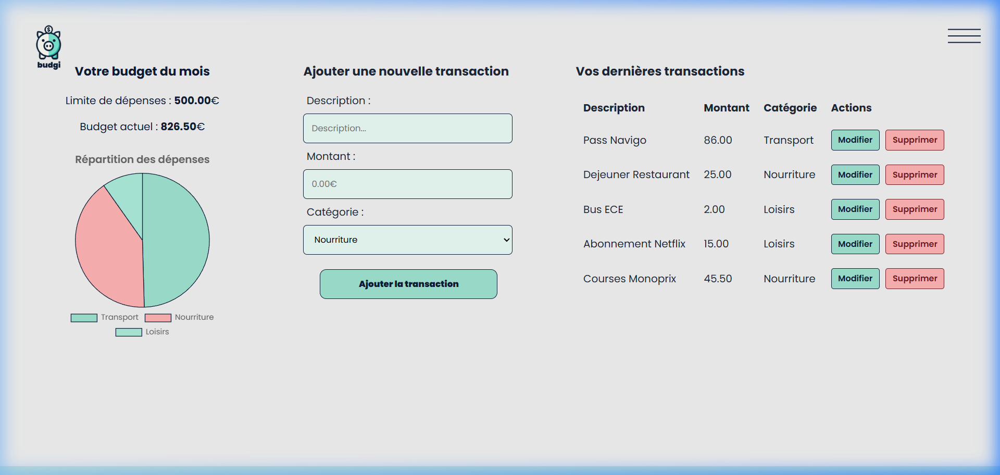
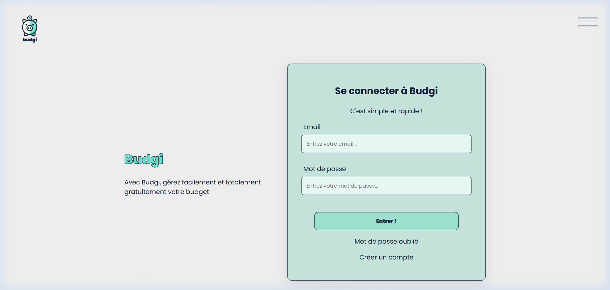
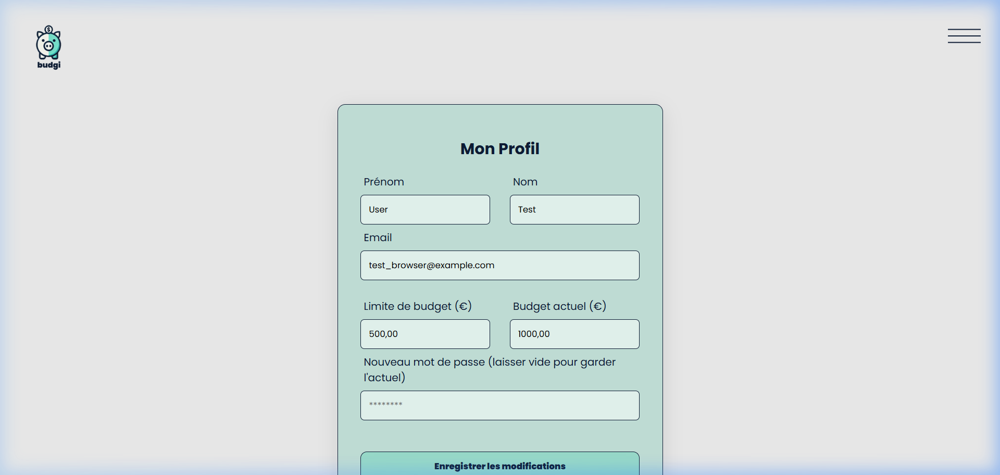

# 💰 Budgi - Gestion de Budget Étudiant

Budgi est une application web moderne et élégante conçue pour aider les étudiants à gérer leurs finances mensuelles de manière simple et visuelle.

## 📸 Aperçu de l'application

### Tableau de Bord Complet
Le centre de contrôle de tes finances, avec une visualisation claire de tes dépenses (Chart.js) et un historique complet des transactions.


### Inscription et Connexion
Une interface épurée pour commencer à gérer ton budget en quelques secondes.


### Gestion du Profil
Personnalise tes informations et ajuste tes limites de budget à tout moment.


## 🚀 Fonctionnalités Clés

- **Visualisation par Chart.js** : Répartition automatique de tes dépenses par catégorie (Nourriture, Loisirs, Transport, etc.).
- **Gestion Complète des Transactions** : Ajoute, modifie ou supprime tes dépenses en temps réel.
- **Calculateur de Budget** : Ton solde actuel se met à jour instantanément après chaque action.
- **Sécurité et Modernité** : Architecture robuste utilisant Docker, PostgreSQL et Composer (`phpdotenv`).

## 🛠️ Technologies

- **Backend** : PHP 8.2 (Apache)
- **Base de données** : PostgreSQL 15
- **Dépendances** : Composer, phpdotenv
- **Frontend** : HTML5, Vanilla CSS, JavaScript, Chart.js
- **Infrastructure** : Docker, Docker Compose

## 📦 Installation Rapide (Docker)

1. **Configurer l'environnement** :
   ```bash
   cp .env.example .env
   ```
2. **Lancer l'application** :
   ```bash
   docker-compose up -d --build
   ```
3. **Accéder au projet** :
   Ouvrez [http://localhost:8082](http://localhost:8082).

---
Développé avec ❤️ pour simplifier la vie des étudiants.
